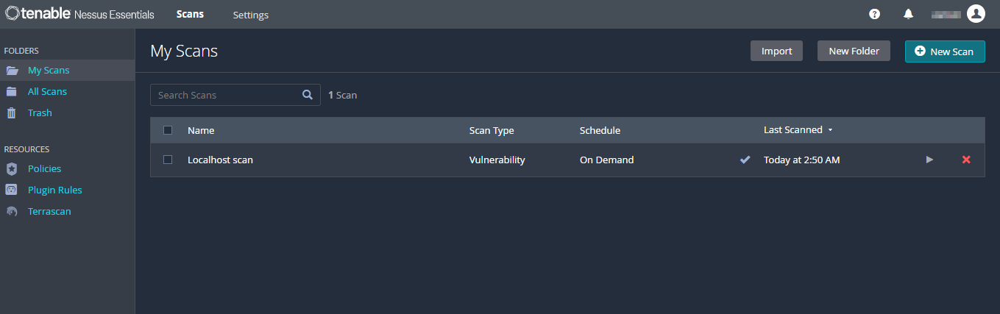
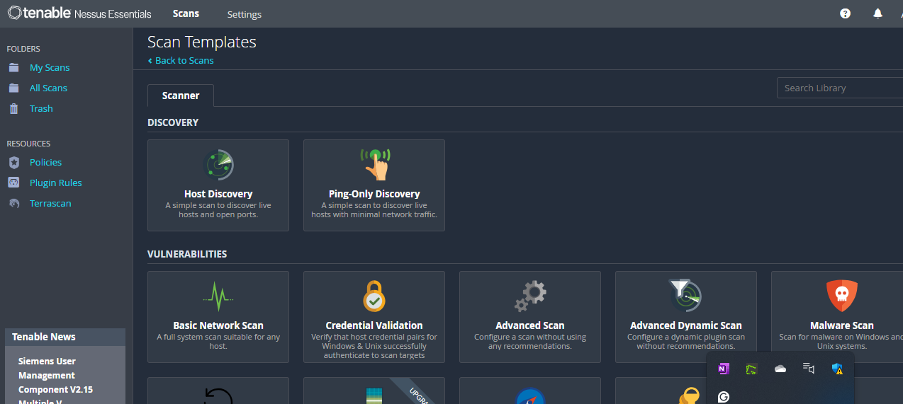
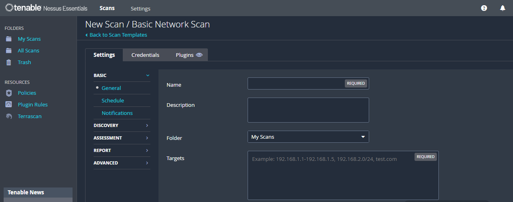
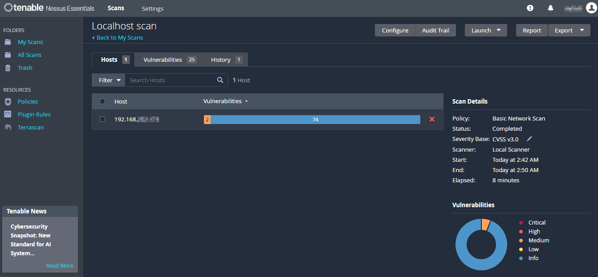
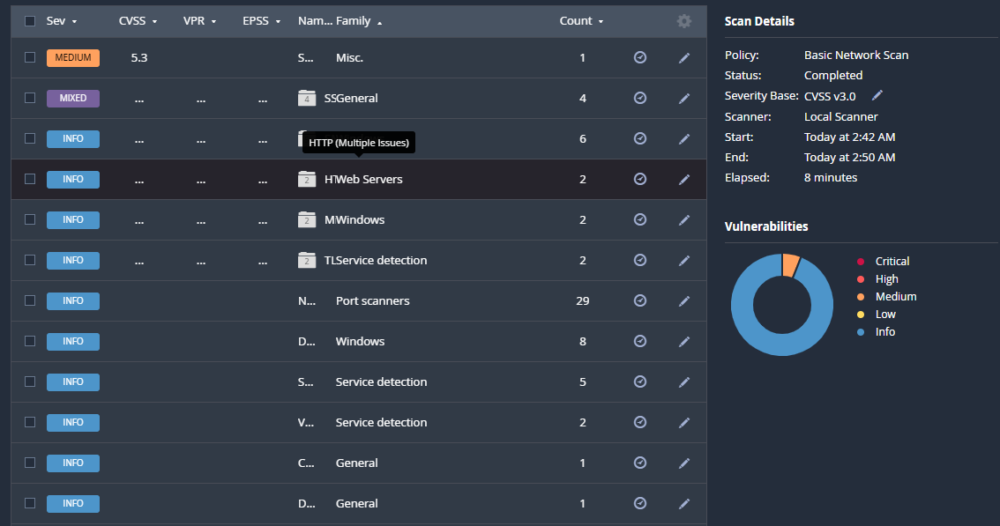
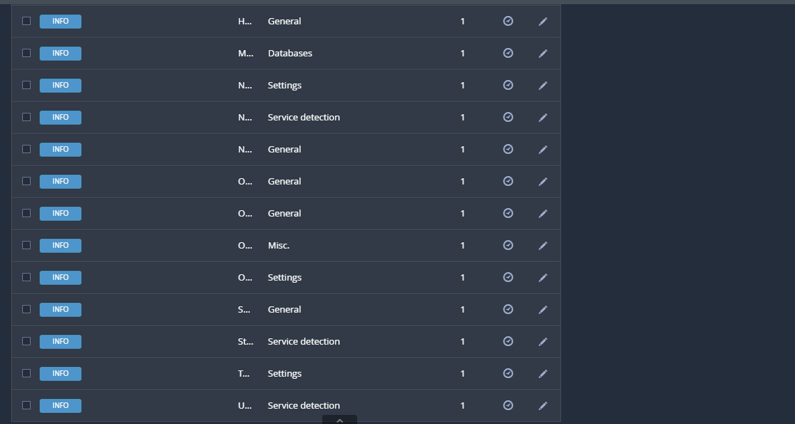

1. **Launch Nessus & Configure**

- Start Nessus via browser (`https://localhost:8834`)
- Activate with the key received in email

2. **Nessus Interface**
   
- After activation you'll see a webpage like this:
  
  

3. **Create a New Scan**

- Navigate to **Scans → New Scan**
- Choose **Basic Network Scan**

  

4. **Fill Scan Details**

- Name
- Target

  

  After fillings the details, run the Scan. The scan may take 5–15 minutes depending on system resources.

5. **View and Analyze Results**

- Click on the scan name → Review vulnerability list

  
  
6. **Let's Analyze My Findings**

   
   

   The scan found various **INFO-level issues**, and a couple of **medium-level** vulnerabilities. Here are the Key Findings:

   1. Medium Severity: HTTP (Multiple Issues)
      
      Family: HTTP

      Count: 6

      Severity: Medium

      Possible Issues: Missing security headers, outdated server version, cleartext communication, etc.

   2. Mixed Severity: General Services
      
      Family: SSGeneral

      Count: 4

      Severity: Mixed (likely includes both Medium and Info level)

   3. Info-Level Findings
      
      Port Scanners (29 issues)

      Service Detection (multiple families: Windows, TLS, etc.)

      OS and Software Configuration Details (common info exposures)

   ### Mitigation Steps:
   
      1. **Enable HTTPS**

         - Use Let's Encrypt or a paid SSL certificate.

         - Redirect all HTTP traffic to HTTPS.

      2. **Add Security Headers in Web Server Configuration**

           For Apache:

               
                  Header always set X-Frame-Options "DENY"
                  Header always set X-Content-Type-Options "nosniff"
                  Header always set Referrer-Policy "no-referrer"
         
            For Nginx:

               
                  add_header X-Frame-Options "DENY";
                  add_header X-Content-Type-Options "nosniff";
                  add_header Referrer-Policy "no-referrer";
               
      3. **Update Web Server Software**

         - Regularly update Apache/Nginx to patch known CVEs.

         - Disable server version disclosure:

            - Apache: `ServerSignature Off`, `ServerTokens Prod`

            - Nginx: `server_tokens off;`

